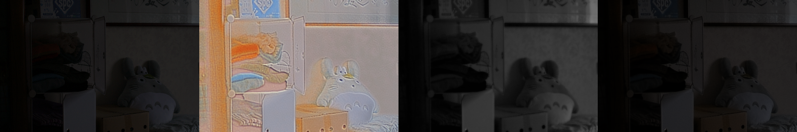

# Deep Retinex Decomposition for Low-Light Enhancement, BMVC'18 (Unofficial PyTorch Code)
Unofficial PyTorch code for the paper - Deep Retinex Decomposition for Low-Light Enhancement, BMVC'18 (Oral), Chen Wei, Wenjing Wang, Wenhan Yang, and Jiaying Liu

The offical Tensorflow code is available [here](https://github.com/weichen582/RetinexNet). 


### Training
Please download the training and testing datasets from [here](https://daooshee.github.io/BMVC2018website/).

在训练时用到了our485和syn数据集，一共1485张训练集，验证集一共15张，测试集若干张

```
python -m torch.distributed.launch --nproc_per_node=4 --master_port=4575 train.py
```

```
RetinexNet:
  - data
    - LOLdataset
      - eval15
        - high
        - low
      - our485
        - high
        - low
      - synthetic
        - high
        - low
```


### Testing
For sample testing/prediction, you can run-
```
$ python predict.py
```

### Train Result

#### Decompose(Stage1)

**Image: low** (`./images/Decom_low_image.png`)

**Left to Right: Ori, R, I, Restore(R*I)**




**Image: high** (`./images/Decom_high_image.png`)

**Left to Right: Ori, R, I, Restore(R*I)**


#### Relight(Stage2)

**Image: low reconstruct** (`./images/Reconstruct_image.png`)

**Left to Right: GT, lowR, lowI, RecI, RecR**

